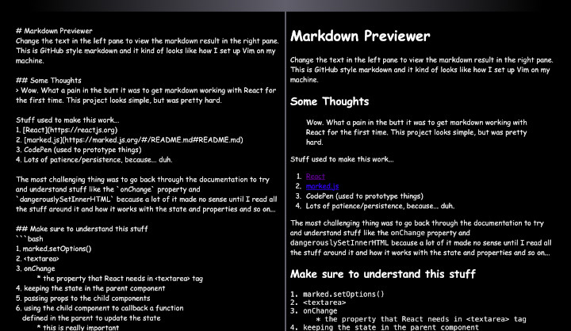

# Markdown Preview
Preview your markdown in this app.

## Purpose/Goal
To learn about markdown and how to implement a third party library/package.

## Operation
Change the markdown in the left pane to see the result in the right pane.

## Tech/Libraries Used
* HTML
* CSS
* JavaScript
* markedjs

## Problems/Solutions
N/A

## More Information
My markdown previewer project as part of Free Code Camp's program.
Hosted on my AWS Lightsail instance.
